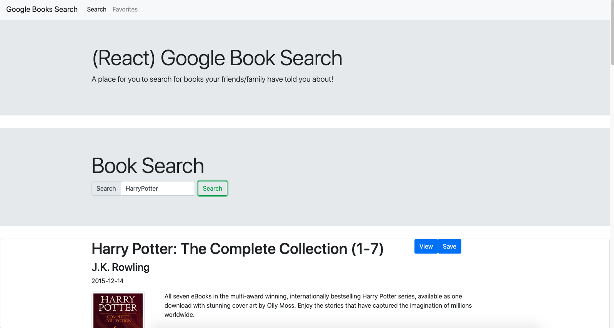

# Google_Book_Search
A react application that uses the Google Books API and allows for users to search for and save books. 

# Description
My first stab at building a full stack MERN application that has CRUD capabilities. It uses the google books api to allow a user to search for books
based on a search term. If the user decides that they are interested in a specific book, then they can save that book to their favorites list. A user can also navigate between the search page and their favorites page. If a user goes to their favorites page, then all their favorite books are displayed. If user decides that they dont like that book anymore then they can also delete that book from their favorites list. 

# Tech Used

* MongoDB
* Express
* React  
* Node
* Google Books API
* Axios 

# ScreenShot of App

# Link to Deployed App
[Click Here](https://reactgooglebooksearch99.herokuapp.com/) to access deployed heroku app. 